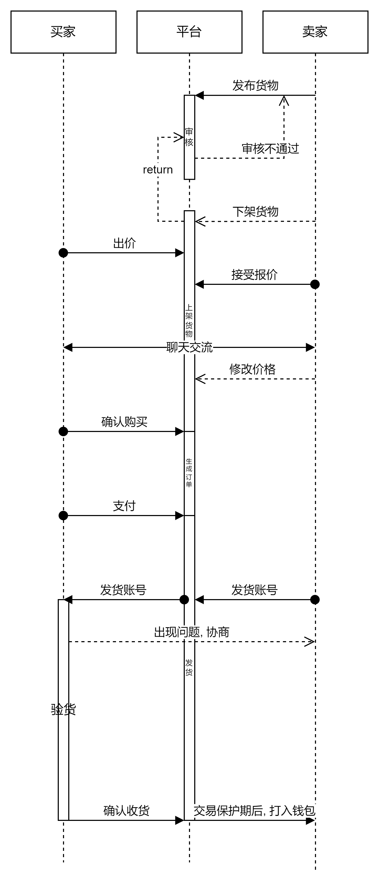

#         				“闲橘”业务服务项目说明文档

## *1. 项目地址和规划*

###    	 1.1 项目地址

​                 [github organization 仓库链接](https://github.com/west2-xianju/XianJu.git)

​				[“闲橘”业务服务端java实现仓库链接](https://github.com/west2-xianju/XianJuService.git)

### 		1.2 项目规划（每周进行线上讨论）

​				3.18-3.24	学习所需技术栈，对业务逻辑进行讨论，明确功能需求和实现逻辑

​				3.25-4.1	 小组讨论撰写逻辑架构，并以此为主体在apifox上编辑所需的接口文档(详情见pdf)

​									建表，后端同步数据库，明确数据模型

​				4.2-4.24 	代码的编写，中途出现或者遇到的问题每周进行一次线上讨论

***

​																			*** 期中考试 ***

***

​				5.4-5.28	前后端联调，和项目的部署，debug和调试

### 1.3 业务逻辑

## *2. 项目使用到的技术栈*

​												1.	**springboot+mybatisplus+mysql**

​												2.	**整合redis和springsecurity**

## *3. 当前完成的进度*

​			经过分工，两个后端已经基本完成了代码的编写和服务器的部署

​			我的负责部分为完成app主服务器后端接口代码的编写

​			后台管理系统的搭建和聊天模块的实现则是由另一位后端队友郑智荣学长实现

​			目前均已经能够线上跑

## *4. 项目结构*

​		目前项目大致结构分为以下三个部分（详情见链接）

​							1. [服务器架构](https://a92xfpz1s6.feishu.cn/mindnotes/Uh7vbVq3UmCZWgnGIJtcBbetnge)

​							2. [后台架构](https://a92xfpz1s6.feishu.cn/mindnotes/XitwbqvO6mUEHrn8h2xceKGsnEh)

​							3. [app逻辑](https://a92xfpz1s6.feishu.cn/mindnotes/Spuwbe0fqmYMQ2nk1UzcssrxnIg)																

## *5. 合作情况：*

​		目前各业务服务接口已经联调完成并且有相应的视频演示

​		（用户，用户评价，货物，订单，出价，搜索，钱包）

​		已在阿里云服务器linux部署docker并作了mysql,redis,java的相关配置，目前已经云服务器部署完成

​	

## *6.java后端相关考察完成情况*

### 6.1支持基本交易功能

- 支持业务逻辑相关接口的实现

### 6.2项目亮点：

- 正则表达式做实名认证时身份证号的检验

- 支持支付宝在线充值支付

- redis做验证码和token的缓存减少数据库压力，提升数据读取速度

### 6.3项目源码架构

业务服务器项目目录树

- D:xianju
  │  .gitignore
  │  HELP.md
  │  mvnw
  │  mvnw.cmd
  │  pom.xml
  │  xianju.iml
  │
  ├─.idea
  │  │
  │  ├─dataSources
  │  │  │
  │  │  ├─4de23d1f-ecec-47da-8f1e-0c9b23ac3d02
  │  │  │  └─storage_v2
  │  │  │      └─_src_
  │  │  │          └─schema
  │  │  │
  │  │  └─c1707fea-4b6e-4279-bec8-a09f85b368a7
  │  │      └─storage_v2
  │  │          └─_src_
  │  │              └─schema
  │  │
  │  └─libraries
  │
  ├─.mvn
  │  └─wrapper
  │
  ├─Docker
  │
  ├─src
  │  ├─main
  │  │  ├─java
  │  │  │  └─com
  │  │  │      └─xianju
  │  │  │          │  XianjuApplication.java
  │  │  │          │
  │  │  │          └─demo
  │  │  │              ├─BaseResponse
  │  │  │              │
  │  │  │              ├─config
  │  │  │              │
  │  │  │              ├─controller
  │  │  │              │
  │  │  │              ├─entity
  │  │  │              │
  │  │  │              ├─Handler
  │  │  │              │
  │  │  │              ├─mapper
  │  │  │              │
  │  │  │              ├─resolver
  │  │  │              │
  │  │  │              ├─Security
  │  │  │              │
  │  │  │              ├─service
  │  │  │              │  │
  │  │  │              │  └─impl
  │  │  │              │
  │  │  │              ├─Util
  │  │  │              │
  │  │  │              └─vo
  │  │  │
  │  │  └─resources
  │  │      │
  │  │      └─mapper
  │  │          └─demo
  │  │
  │  └─test
  │      └─java
  │          └─com
  │              └─xianju
  │                  ├─CodeGenerator
  │                  │
  │                  └─test
  │
  └─target
      │
      ├─classes
      │  │
      │  ├─com
      │  │  └─xianju
      │  │      │
      │  │      └─demo
      │  │          ├─BaseResponse
      │  │          │
      │  │          ├─config
      │  │          │
      │  │          ├─controller
      │  │          │
      │  │          ├─entity
      │  │          │
      │  │          ├─Handler
      │  │          │
      │  │          ├─mapper
      │  │          │
      │  │          ├─resolver
      │  │          │
      │  │          ├─Security
      │  │          │
      │  │          ├─service
      │  │          │  │
      │  │          │  └─impl
      │  │          │
      │  │          ├─Util
      │  │          │
      │  │          └─vo
      │  │
      │  └─mapper
      │      └─demo
      │
      ├─generated-sources
      │  └─annotations
      ├─generated-test-sources
      │  └─test-annotations
      ├─maven-archiver
      │
      ├─maven-status
      │  └─maven-compiler-plugin
      │      ├─compile
      │      │  └─default-compile
      │      │
      │      └─testCompile
      │          └─default-testCompile
      │
      └─test-classes
          └─com
              └─xianju
                  ├─CodeGenerator
                  │
                  └─test

### 6.4代码风格

- restful接口规范，采用阿里巴巴开发规范

- 对复杂的函数进行整体介绍或者逐行注释介绍

​    （如alipay，captchaUtil，IDUtil，snowFlakeID等）

### 6.5项目文档

- 闲橘项目API文档：[闲橘apifox接口文档](https://apifox.com/apidoc/shared-75b228ec-c55b-4115-84c1-9dbcdb11ed5b)

### 6.6服务安全性能

- 引入springsecurity对项目进行登录，登出，顶号，鉴权的拦截处理

### 6.7支持对接真实支付宝充值功能

- 对支付宝进行了相关配置，支持对接支付宝进行在线支付

  这个方面在代码编写与自行测试的时候已经完成，利用沙箱账号也是正常测试通过。

### 6.8支持事务回滚，事故处理

- @transectional注解设置自动回滚

- 交易产生风险时封禁用户账号，进入黑名单，黑名单用户页面功能收到限制，由后台管理系统进行管理

## *7.未完成的部分*

1. 支付宝接口在使用沙箱账号测试时没有问题能够正常跳转页面并且进行回调，但是在前后端联调时在配置和密钥正确的情况下移动端未能正确跳转，并出现类似图中的乱码问题

2. 多次使用mybatisplus中的LambdaQueryWrapper进行查询但是没有对其进行封装，导致代码冗余
3. 虽然聊天服务器是另一位后端队友做的，但是我也有在自己项目上进行websocket的整合，目前整合上项目之后聊天模块的接口已经可以使用，但未能与前端进行联调

### 	ps:后端项目目前已进行服务器部署，公网可以访问（但是因为服务器被攻击所以现在把端	口都关闭了，需要使用的时候再自行开启

​							公网ip：121.40.105.104			端口号：5002

